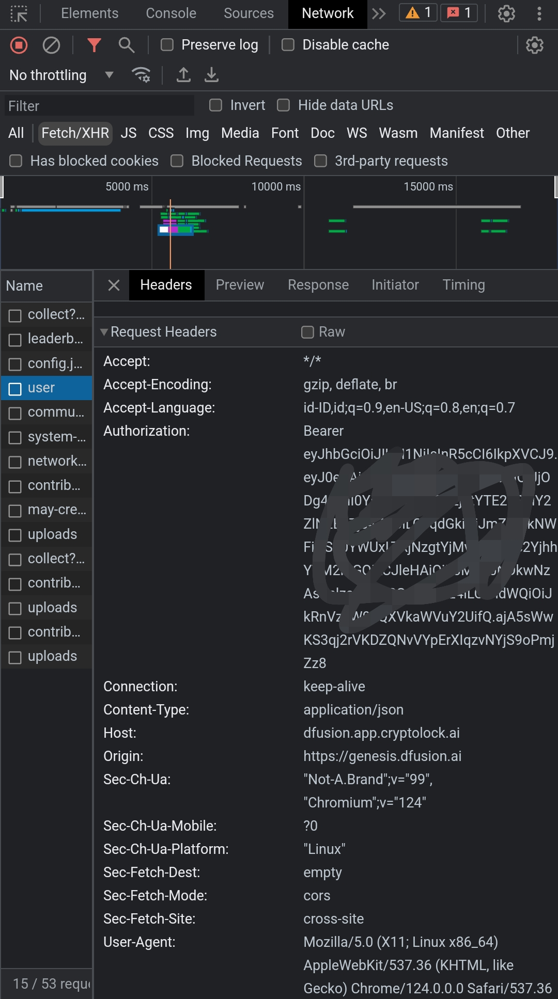

# Dfusions Auto Generate and upload files

This script automates generate files and upload it to dfussions dashboard.

## Features

- **Auto Generate files**
- **Auto Upload Files**
- **Support multiple accounts**

## Prerequisites

- Node.js installed on your machine
- gemini apikey you can get one here: https://aistudio.google.com/app/apikey
- anti-captcha apikey you can get it here: https://anti-captcha.com/clients/settings/apisetup
- dfusions token: register here [https://genesis.dfusion.ai](https://genesis.dfusion.ai?r=5ukxtqls)
- inspect or f12 if you already login, find Application and copy user value.
    

## Installation

1. Clone the repository:
    ```sh
    git clone https://github.com/NubiZen/dfusions.git
    cd dfusions
    ```

2. Install the required dependencies:
    ```sh
    npm install
    ```
3. input token at `tokens.txt` file
    ```bash
    nano tokens.txt
    ```
4. Run the script: for first time running this will ask you to input apiKey
    ```sh
    node main.js
    ```
# dfusions
